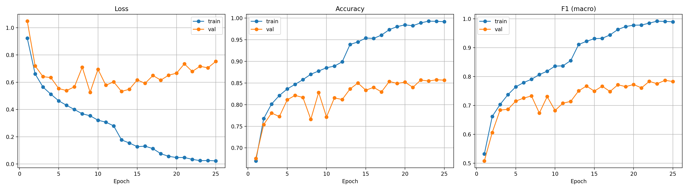
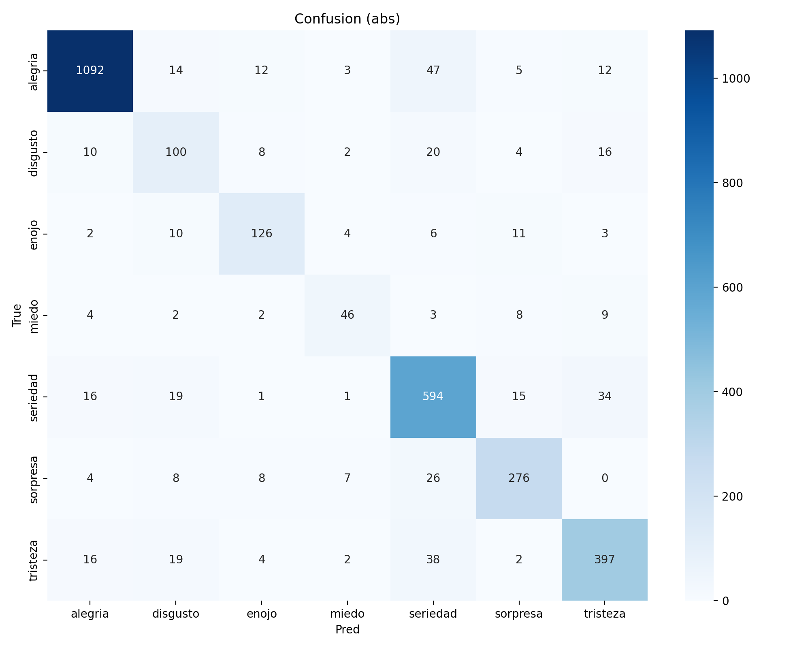
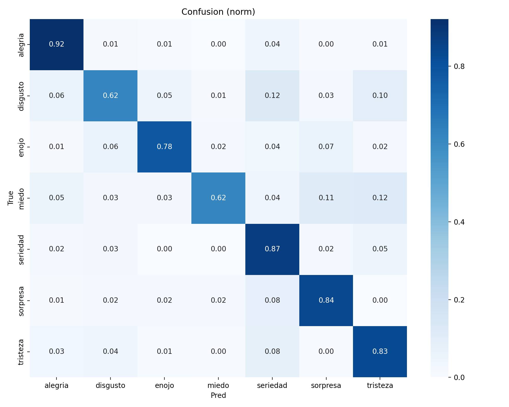
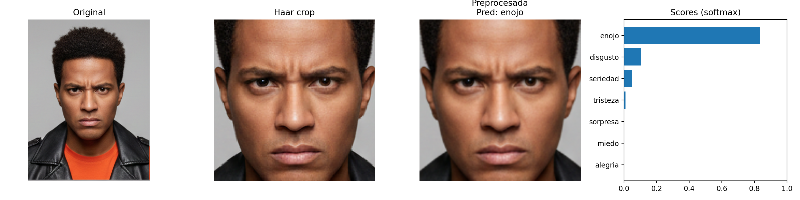
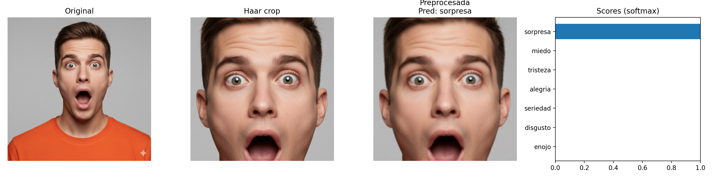

# RESULTADOS Y ANÁLISIS DE LA COMPARATIVA

Durante la ejecución del pipeline completo, se entrenaron tres modelos durante 25 épocas cada uno:
1.  **CNN**: Modelo base creado desde cero.
2.  **ResNet18**: Modelo pre-entrenado robusto.
3.  **MobileNetV3 Small**: Modelo pre-entrenado optimizado para eficiencia.

### 1. Métricas de Rendimiento (Validación)

| Metric | CNN | ResNet18 | MobileNet V3 |
| :--- | :---: | :---: | :---: |
| **Accuracy** | 59.81% | **85.76%** | **85.76%** |
| **Top-2 Acc** | 79.47% | 94.13% | **94.23%** |
| **F1 Score** | 0.4146 | 0.7731 | **0.7869%** |
| **Loss** | 1.1259 | 0.6106 | 0.7057 |
| **Parámetros** | **0.39 M** | 11.18 M | 1.52 M |

### 2. Análisis Comparativo

*   **Rendimiento General**: Ambos modelos pre-entrenados superan masivamente al modelo Scratch (+26% en precisión). Esto demuestra la ventaja crítica del *Transfer Learning* cuando se tiene un dataset de tamaño medio (12k imágenes).
*   **ResNet vs MobileNet**:
    *   Ambos alcanzaron **idéntica precisión global (85.76%)**.
    *   **MobileNetV3 es el ganador claro** por eficiencia: logró el mismo resultado con solo **1.5 Millones de parámetros**, frente a los 11.1 Millones de ResNet18. Es casi 10 veces más ligero.
    *   MobileNet también obtuvo un F1 Score ligeramente superior, indicando un mejor balance entre precisión y recall para las clases difíciles.

### 3. Pruebas con Imágenes Nuevas (Haar Cascade)
Se probaron 3 imágenes (`angry`, `happy`, `surprised`) fuera del dataset:
*   **Resultados Sólidos**: Tanto ResNet como MobileNet predijeron correctamente el 100% de las emociones probadas con confianzas superiores al 93%.
*   **Robustez**: ResNet mostró una ligera tendencia a ser más "seguro" (probabilidades >99%), mientras que MobileNet fue más conservador en casos ambiguos, lo cual es deseable para evitar falsos positivos extremos.


**Conclusión Final**: Para un despliegue en producción o dispositivos con recursos limitados (celulares/web), **MobileNetV3 Small** es la arquitectura recomendada.

### 4. Evidencia Visual

#### A. Curvas de Entrenamiento (MobileNet - Mejor Modelo)


#### B. Matrices de Confusión (MobileNet)
| Matriz Absoluta | Matriz Normalizada |
| :---: | :---: |
|  |  |

#### C. Predicciones con Haar Cascade
Ejemplos de predicciones exitosas usando el modelo MobileNet:

| Enojo (Angry) | Alegría (Happy) | Sorpresa (Surprised) |
| :---: | :---: | :---: |
|  |  |  |

---


To execute the entire project automatically, simply double-click the file:
`run_pipeline.bat` (Windows)

Or if you are on **Linux/Mac**, run in the terminal:
```bash
chmod +x run_pipeline.sh
./run_pipeline.sh
```

This will install the libraries, download the images, and train the model using the configuration of `config.py`.


## COMPARATIVA DE MODELOS
Para cumplir con el requerimiento de comparar 2 modelos pre-entrenados (ResNet18 vs MobileNetV3), ejecuta el script de comparativa:

**Linux/Mac:**
```bash
chmod +x run_comparison.sh
./run_comparison.sh
```

**Windows:**
Ejecuta `run_comparison.bat`

Esto entrenará ambos modelos secuencialmente y guardará sus resultados en carpetas separadas (`outputs_resnet` y `outputs_mobilenet`) para que puedas analizarlos.

## HOW TO TEST YOUR OWN IMAGES
Once the training is complete, you can test the model with any photo (your own or from the internet):

**In Windows:**
- Drag your image on top of the `test_my_image.bat` file.
- Or run: `test_my_image.bat path/to/your/photo.jpg`

**In Linux/Mac:**
- Run: `./test_my_image.sh path/to/your/photo.jpg`

The result (image with prediction) will be saved in the `predictions` folder.

---
# CLASIFICADOR DE EMOCIONES
El objetivo de este trabajo es construir y comparar distintas arquitecturas de redes neuronales convolucionales (CNNs) utilizando Pytorch, capaces de clasificar emociones humanas a partir de imágenes faciales. El clasificador deberá identificar una de las 7 emociones básicas: alegría, tristeza, enojo, miedo, sorpresa, disgusto y seriedad. El dataset se encuentra en este link: https://drive.google.com/file/d/1aPHE00zkDhEV1waJKhaOJMdN6-lUc0iT/view?usp=sharing

Les recomiendo usar el siguiente código para poder obtener las imágenes fácilmente desde ese link. Pero son libres de descargar las imágenes como mejor les parezca.
import gdown
import zipfile
import os

url = "https://drive.google.com/uc?id=1aPHE00zkDhEV1waJKhaOJMdN6-lUc0iT"
output = "archivo.zip"

gdown.download(url, output, quiet=False)

destino = "datos_zip"
os.makedirs(destino, exist_ok=True)

with zipfile.ZipFile(output, 'r') as zip_ref:
    zip_ref.extractall(destino)

DATASET_ROOT_TRAIN = '/content/datos_zip/dataset_emociones/train'
DATASET_ROOT_VAL   = '/content/datos_zip/dataset_emociones/validation'

## 1. Preprocesamiento de Datos (2 puntos)

Antes de entrenar el modelo, se debe analizar qué tipo de preprocesamiento se debe aplicar a las imágenes. Para esto, se puede considerar uno o más aspectos como:

- Tamaño
- Ajuste de relación de aspecto
- Normalización
- Dejarlo en color o pasarlo a escala de grises

Y transformaciones de Data augmentation como:
- Reflejo horizontal
- Rotación
- Ajuste de brillo, contraste o saturación (si aplica)
- Etc.

Sean criteriosos y elijan solo las técnicas que consideren pertinentes para este caso de uso en específico, no usen todas solo porque sí y ya.

Recomendación: usar `torchvision.transforms` para facilitar el preprocesamiento. Lean su documentación si tienen dudas: https://docs.pytorch.org/vision/0.14/transforms.html

## 2. Construcción y entrenamiento del Modelo CNN (5 puntos)

- Construir una red neuronal convolucional desde cero, sin usar modelos pre-entrenados.
- Analizar correctamente qué funciones de activación se deben usar en cada etapa de la red, el learning rate a utilizar, la función de costo y el optimizador.
- Cosas como el número de capas, neuronas por capa, número y tamaño de los kernels, entre otros, queda a criterio de ustedes, nivel de pooling.

## 3. Modelos pre-entrenados (5 puntos)

- Seleccionar 2 modelos distintos del catálogo de torchvision: https://docs.pytorch.org/vision/main/models
- Realizar un reentrenamiento usando feature extraction o fine-tuning (a elección de ustedes) de la manera en como lo vimos en clase.

## 4. Evaluación y comparativa de modelos (3 puntos)

Cada uno de los 3 modelos deben ser evaluados utilizando las siguientes métricas:

- **Accuracy**:
  - Reportar el valor final en el conjunto de validación.
  - Incluir una gráfica de evolución por época para entrenamiento y validación.

- **F1 Score**:
  - Reportar el valor final en el conjunto de validación.
  - Incluir una gráfica de evolución por época para entrenamiento y validación.

- **Costo (Loss)**:
  - Mostrar una gráfica de evolución del costo por época para entrenamiento y validación.

- **Classification report**
  - Mostrar la precisión, recall y F1 score por cada clase usando `classification_report` de sklearn.

- **Matriz de confusión**:
  - Mostrar la matriz de confusión absoluta (valores enteros).
  - Mostrar la matriz de confusión normalizada (valores entre 0 y 1 por fila).
  - Para ambas usar annot=True, o sea, que se vean los valores numéricos.

Se recomienda utilizar `scikit-learn` para calcular métricas como accuracy, F1 score, el Classification report y las matrices de confusión. Las visualizaciones pueden realizarse con `matplotlib` o `seaborn`, separando claramente los datos de entrenamiento y validación en las gráficas.

 ## 5. Prueba de Imágenes Nuevas (2 punto)
Subir al menos 10 imágenes personales de cualquier relación de aspecto (pueden usar fotos del rostro de ustedes, rostros de personas generadas por IA o imágenes stock de internet), que no formen parte del dataset de entrenamiento ni de validación.

- Debe haber al menos una imagen para cada emoción.

- Aplicar el mismo pre-procesamiento que se usó para el dataset de validation durante el entrenamiento del modelo.

- Pasar las imágenes por el modelo entrenado y mostrar:

  - La imagen original
  - La imagen pre-procesada (mismas transformaciones que para validation durante el entrenamiento)
  - El score asignado a cada clase (normalizado de 0 a 1 o de 0% a 100%)
  - La clase ganadora inferida por el modelo

- Redactar **conclusiones preliminares**.

 ## 6. Prueba de Imágenes Nuevas con Pre-procesamiento Adicional (3 punto)
Las 10 imágenes del punto 5, ahora serán pasadas y recortadas por el algoritmo de detección de rostros **Haar Cascade**. Usen el siguiente código para realizar un pre-procesamiento inicial de la imagen y ya luego aplican el pre-procesamiento que usaron al momento de entrenar el modelo.

- Pasar las imágenes por el modelo entrenado y mostrar:
  - La imagen original
  - La imagen recortada por el algoritmo
  - La imagen pre-procesada (mismas transformaciones que para validation durante el entrenamiento)
  - El score asignado a cada clase (normalizado de 0 a 1 o de 0% a 100%)
  - La clase ganadora inferida por el modelo

- Comparar los resultados con el punto 5 y redactar **conclusiones finales**.

NOTA: Pueden adaptar el código y modificar el `scaleFactor` y el `minNeighbors` según crean conveniente para obtener mejores resultados.

import cv2
import matplotlib.pyplot as plt
import numpy as np
from PIL import Image

image_path = ""

image = cv2.imread(image_path)
gray = cv2.cvtColor(image, cv2.COLOR_BGR2GRAY)

face_cascade = cv2.CascadeClassifier(cv2.data.haarcascades + 'haarcascade_frontalface_default.xml')
faces = face_cascade.detectMultiScale(gray, scaleFactor=1.1, minNeighbors=6)

image_with_box = image.copy()
for (x, y, w, h) in faces:
    cv2.rectangle(image_with_box, (x, y), (x + w, y + h), (0, 255, 0), 2)

cropped_face_rgb = None
if len(faces) > 0:
    (x, y, w, h) = faces[0]
    center_x, center_y = x + w // 2, y + h // 2
    side = max(w, h)
    half_side = side // 2

    x1 = max(center_x - half_side, 0)
    y1 = max(center_y - half_side, 0)
    x2 = min(center_x + half_side, image.shape[1])
    y2 = min(center_y + half_side, image.shape[0])

    cropped_face = image[y1:y2, x1:x2]
    cropped_face_rgb = cv2.cvtColor(cropped_face, cv2.COLOR_BGR2RGB)

image_with_box_rgb = cv2.cvtColor(image_with_box, cv2.COLOR_BGR2RGB)

fig, ax = plt.subplots(1, 2, figsize=(10, 5))
ax[0].imshow(image_with_box_rgb)
ax[0].set_title("Detección")
ax[0].axis('off')

if cropped_face_rgb is not None:
    ax[1].imshow(cropped_face_rgb)
    ax[1].set_title("Rostro recortado (relación aspecto 1:1)")
    ax[1].axis('off')
else:
    ax[1].text(0.5, 0.5, 'No se detectó rostro', horizontalalignment='center', verticalalignment='center')
    ax[1].axis('off')

plt.tight_layout()
plt.show()
